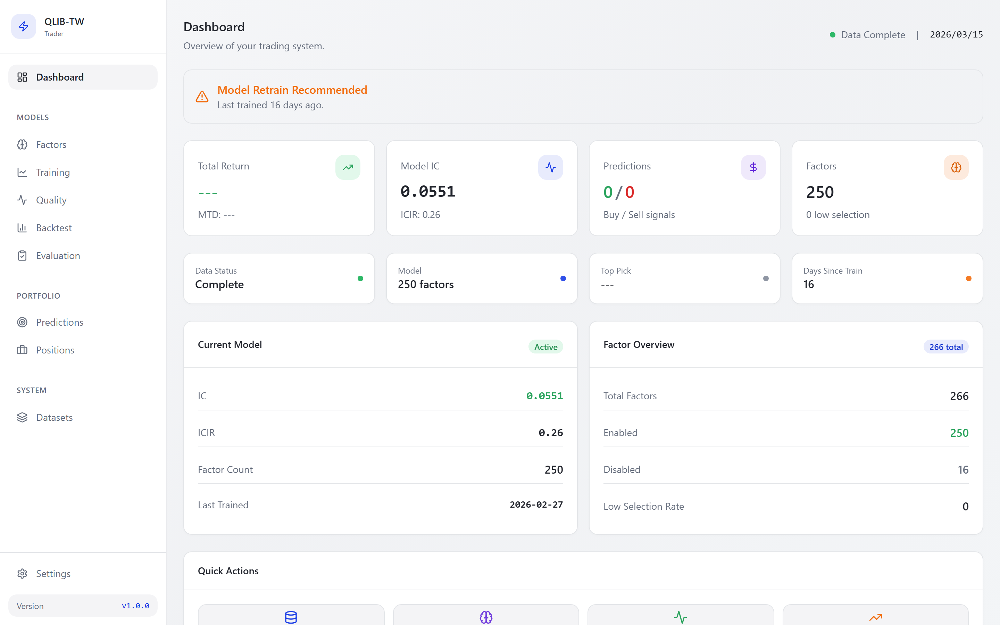
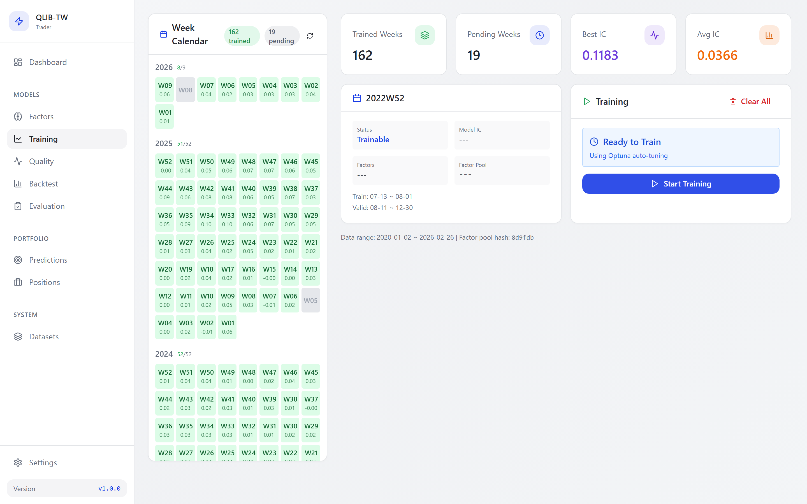
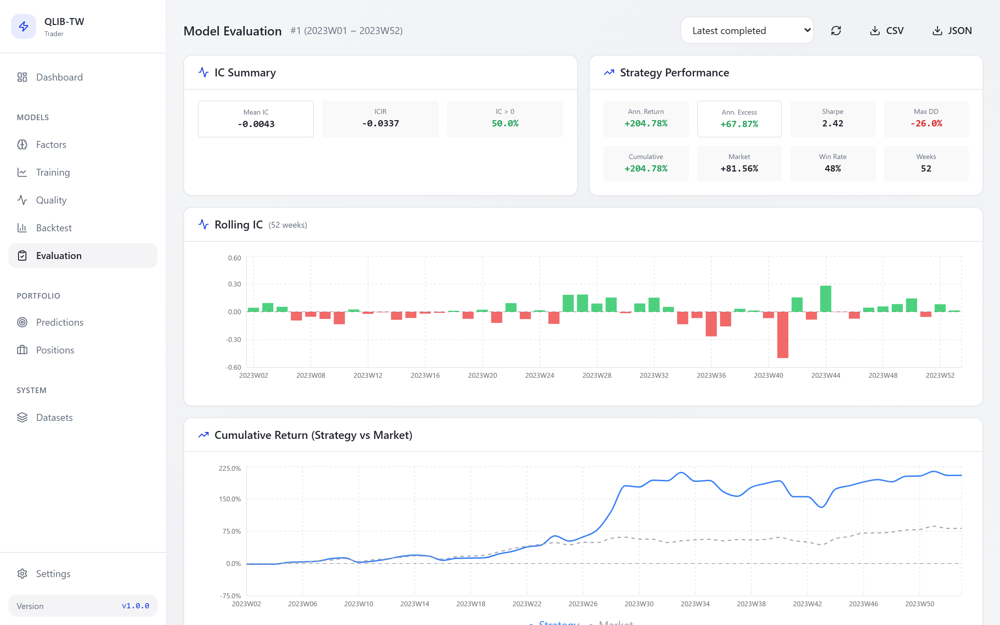
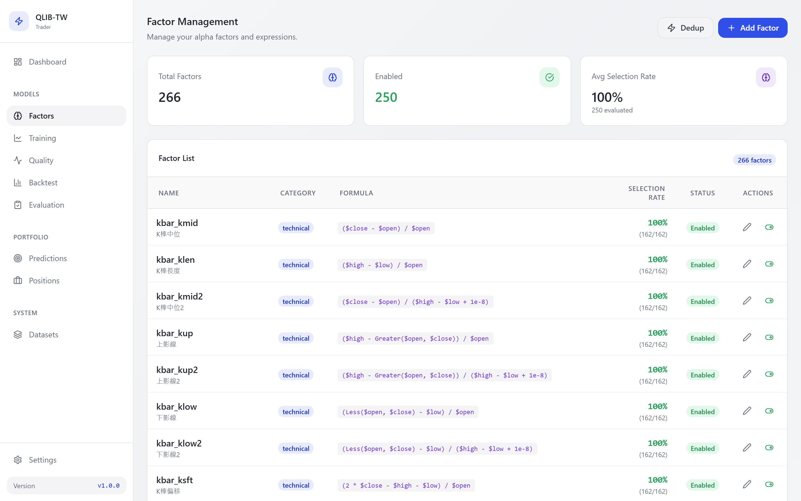
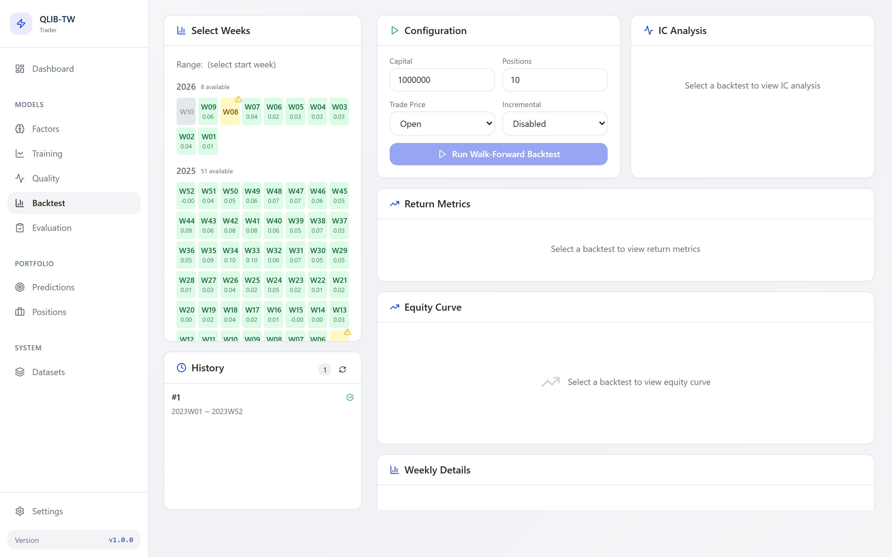
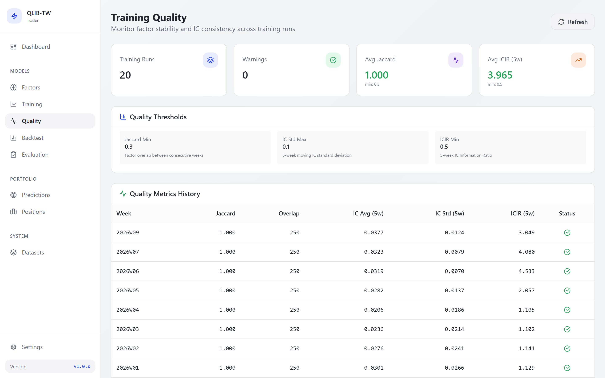
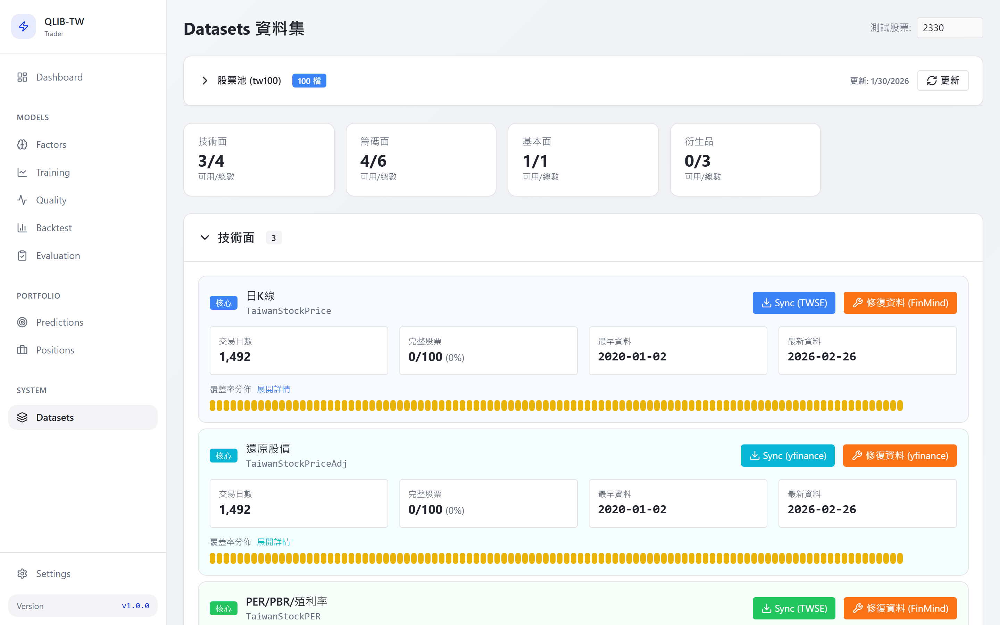

[English](README.md) | [繁體中文](README.zh-TW.md)

<h1 align="center">qlib-tw-trader</h1>

<p align="center">
  <strong>End-to-end quantitative trading system for Taiwan stocks</strong>
</p>

<p align="center">
  
  
  
  
  
  
</p>

<p align="center">
  
</p>

## What is qlib-tw-trader?

qlib-tw-trader is a full-stack quantitative trading research platform built for Taiwan's stock market. It automates the entire workflow that a quantitative researcher would do manually:

1. **Collect data** from official Taiwan Stock Exchange (TWSE), FinMind, and Yahoo Finance
2. **Compute ~300 alpha factors** including price-volume patterns, institutional order flow, and cross-asset interactions
3. **Train ML models** using DoubleEnsemble (ICDM 2020) -- an iterative ensemble that automatically selects useful features and reweights difficult samples
4. **Backtest strategies** with a rigorous 156-week Walk-Forward framework where each week's model is trained only on past data
5. **Generate daily signals** ranking Taiwan's top-100 stocks by predicted 2-day return
6. **Monitor everything** through a React dashboard with real-time WebSocket updates

The system is designed with **strict lookahead bias prevention**: trades on day T use only features available at T-1 close, with a 7-day embargo between training and validation sets. This is not a toy backtest -- it's a research tool built to produce results you can trust.

## Walk-Forward Backtest Results

All results are **out-of-sample**, from a 156-week (3-year) Walk-Forward backtest with weekly model retraining.

### LightGBM vs DoubleEnsemble

| Metric | LightGBM | DoubleEnsemble | Change |
|--------|:--------:|:--------------:|:------:|
| Backtest IC | 0.0107 | **0.0166** | +55% |
| IC Decay (valid → backtest) | 78.5% | **56.0%** | -23pp |
| Best Strategy Sharpe | 1.006 | **1.724** | +71% |
| Best Excess Return | +0.2% | **+23.9%** | |
| Quantile Monotonicity (rho) | 0.90 | **1.00** | Perfect |
| Spread t-stat | 1.25 | **2.30** | Significant |

### Best Strategy: HoldDrop(K=10, H=3, D=1)

| Metric | Value | Metric | Value |
|--------|:-----:|--------|:-----:|
| Ann. Return | 55.1% | Ann. Excess | +23.9% |
| Sharpe | 1.724 | Max Drawdown | 38.7% |
| Turnover | 9.9%/week | t-stat | 1.89 |

<details>
<summary><strong>Yearly breakdown</strong></summary>

| Year | Excess | Sharpe | Win Rate | MaxDD |
|:----:|:------:|:------:|:--------:|:-----:|
| 2023 | +80.0% | 2.96 | 54.5% | 18.0% |
| 2024 | -8.4% | 0.45 | 47.9% | 21.2% |
| 2025 | +19.6% | 1.62 | 51.3% | 29.4% |

</details>

<details>
<summary><strong>Market regime analysis</strong></summary>

| Regime | Mean IC | Excess (bps/day) | Win Rate |
|:------:|:-------:|:-----------------:|:--------:|
| Bear | **0.0354** | +10.0 | **55.2%** |
| Sideways | 0.0146 | **+13.4** | 50.0% |
| Bull | -0.0002 | +1.8 | 50.2% |

The model's ranking ability is strongest in bear markets where stock dispersion is high.

</details>

<details>
<summary><strong>Comparison with Qlib official benchmarks</strong></summary>

Our IC/ICIR is lower than [Qlib CSI300 benchmarks](https://github.com/microsoft/qlib/tree/main/examples/benchmarks) (IC 0.052, ICIR 0.42), but **Sharpe is higher** (1.72 vs 1.34). This reflects structural differences:

| Factor | Qlib Benchmark | This Project |
|--------|:--------------:|:------------:|
| Universe | CSI300 (300 stocks) | TW100 (100 stocks) |
| Market | China A-shares (retail-driven) | Taiwan (institutional-heavy) |
| Holding | top-50 | top-10 (concentrated) |
| Label | 1-day return | 2-day return |

Direct IC comparison is not meaningful across these conditions. The relevant metric is the **relative improvement** from LightGBM → DoubleEnsemble within the same setup.

</details>

## Screenshots

<details>
<summary><strong>Model Training -- Week calendar with 162 trained models</strong></summary>

</details>

<details>
<summary><strong>Model Evaluation -- Rolling IC, cumulative returns, strategy performance</strong></summary>

</details>

<details>
<summary><strong>Factor Management -- 266 factors with selection rates and formulas</strong></summary>

</details>

<details>
<summary><strong>Walk-Forward Backtest -- Week selection, IC analysis, equity curves</strong></summary>

</details>

<details>
<summary><strong>Training Quality -- Jaccard similarity, IC stability, ICIR tracking</strong></summary>

</details>

<details>
<summary><strong>Datasets -- Multi-source data coverage and sync status</strong></summary>

</details>

## How It Works

<p align="center">
  
</p>

## Features

- **DoubleEnsemble (ICDM 2020)** -- Iterative ensemble with built-in sample reweighting and feature selection. +55% IC over single LightGBM. [[paper]](https://arxiv.org/abs/2010.01265)
- **~300 factor library** -- Alpha158 OHLCV factors (109), Taiwan institutional flow (107), cross-interaction terms (50), and enhanced factors (37) covering volatility regime, momentum, liquidity, and microstructure
- **Walk-Forward backtesting** -- 156-week out-of-sample test with IC Decay analysis, quantile spread, and multi-strategy comparison across 9 strategy variants
- **Strict lookahead bias prevention** -- T-day trades use T-1 features only. 7-day embargo between train/validation sets. Deterministic tie-breaking by stock symbol
- **Multi-source data sync** -- Auto-sync from TWSE OpenAPI, FinMind, and yfinance with priority fallback and coverage tracking
- **Full-stack dashboard** -- 9 pages: Dashboard, Factors, Training, Evaluation, Backtest, Quality, Predictions, Positions, Datasets
- **Optuna hyperparameter search** -- Bayesian optimization over DoubleEnsemble parameters

## Tech Stack

| Layer | Technologies |
|-------|-------------|
| **Backend** | FastAPI, SQLAlchemy 2.0, SQLite (WAL mode) |
| **Frontend** | React 18, Vite, TailwindCSS, Zustand, Recharts |
| **Model** | Qlib (Microsoft), LightGBM, DoubleEnsemble, Optuna |
| **Data** | TWSE OpenAPI, FinMind, yfinance |
| **Real-time** | WebSocket |

## Quick Start

### Docker (recommended)

```bash
git clone https://github.com/Docat0209/qlib-tw-trader.git
cd qlib-tw-trader

cp .env.example .env
# Edit .env with your FinMind API token (free: https://finmindtrade.com/)

docker compose up --build
```

- Frontend: http://localhost:3000
- Backend API: http://localhost:8000
- Swagger: http://localhost:8000/docs

### Manual Setup

```bash
# Backend
python -m venv .venv
source .venv/bin/activate   # Linux/macOS
# .venv\Scripts\activate    # Windows
pip install -r requirements.txt
cp .env.example .env
uvicorn src.interfaces.app:app --reload --port 8000

# Frontend (separate terminal)
cd frontend && npm install && npm run dev

# Seed the factor library (~300 factors)
curl -X POST http://localhost:8000/api/v1/factors/seed
```

## Architecture

<p align="center">
  
</p>

<details>
<summary><strong>Project structure</strong></summary>

```
qlib-tw-trader/
├── src/
│   ├── adapters/           # TWSE, FinMind, yfinance data clients
│   ├── interfaces/         # FastAPI routes, schemas, WebSocket
│   ├── repositories/       # Database access + factor definitions (~300)
│   ├── services/           # Training, prediction, backtesting, Qlib export
│   └── shared/             # Constants, types, week utilities
├── frontend/               # React 18 SPA (9 pages)
├── tests/                  # pytest suite (28 tests)
├── scripts/                # Analysis scripts (model eval, timing, IC)
└── data/                   # Database + models + Qlib exports (gitignored)
```

</details>

## API

Interactive documentation at http://localhost:8000/docs when running.

<details>
<summary><strong>Key endpoints</strong></summary>

| Endpoint | Description |
|----------|-------------|
| `POST /api/v1/sync/all` | Sync all data sources |
| `POST /api/v1/factors/seed` | Initialize ~300 factors |
| `POST /api/v1/models/train` | Train model for a specific week |
| `POST /api/v1/backtest/walk-forward` | Run Walk-Forward backtest |
| `GET /api/v1/backtest/walk-forward/summary` | Aggregated backtest metrics |
| `POST /api/v1/predictions/today/generate` | Generate today's predictions |
| `GET /api/v1/predictions/today` | Get current stock picks |
| `GET /api/v1/predictions/history` | Prediction history |

</details>

## Data Sources

| Priority | Source | Coverage |
|:--------:|--------|----------|
| 1 | TWSE OpenAPI | OHLCV, PER/PBR (available after 17:30 daily) |
| 2 | FinMind | Institutional trades, margin, monthly revenue (600 req/hr free) |
| 3 | yfinance | Adjusted close prices (no rate limit) |

## References

**Core Model:**
- Zhang et al. **"DoubleEnsemble: A New Ensemble Method Based on Sample Reweighting and Feature Selection for Financial Data Analysis."** ICDM 2020. [[paper]](https://arxiv.org/abs/2010.01265)
- Ke et al. **"LightGBM: A Highly Efficient Gradient Boosting Decision Tree."** NeurIPS 2017. [[paper]](https://papers.nips.cc/paper/2017/hash/6449f44a102fde848669bdd9eb6b76fa-Abstract.html)
- Akiba et al. **"Optuna: A Next-generation Hyperparameter Optimization Framework."** KDD 2019. [[paper]](https://arxiv.org/abs/1907.10902)

**Quantitative Finance:**
- Gu, Kelly & Xiu. **"Empirical Asset Pricing via Machine Learning."** Review of Financial Studies, 2020. [[paper]](https://doi.org/10.1093/rfs/hhaa009)
- Grinold & Kahn. **"Active Portfolio Management."** McGraw-Hill, 1999.
- Harvey, Liu & Zhu. **"...and the Cross-Section of Expected Returns."** Review of Financial Studies, 2016. [[paper]](https://doi.org/10.1093/rfs/hhv059)
- Novy-Marx & Velikov. **"A Taxonomy of Anomalies and Their Trading Costs."** Review of Financial Studies, 2016. [[paper]](https://doi.org/10.1093/rfs/hhv063)
- Faber. **"A Quantitative Approach to Tactical Asset Allocation."** Journal of Wealth Management, 2007. [[paper]](https://papers.ssrn.com/sol3/papers.cfm?abstract_id=962461)

**Platform:**
- Yang et al. **"Qlib: An AI-oriented Quantitative Investment Platform."** 2020. [[repo]](https://github.com/microsoft/qlib)
- Lopez de Prado. **"Advances in Financial Machine Learning."** Wiley, 2018. [[book]](https://www.wiley.com/en-us/Advances+in+Financial+Machine+Learning-p-9781119482086)

## Contributing

Contributions are welcome. See [CONTRIBUTING.md](CONTRIBUTING.md) for setup instructions and development workflow.

## License

MIT. See [LICENSE](LICENSE).
